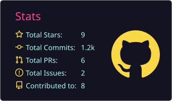
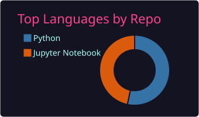
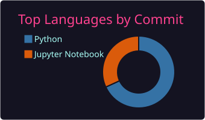
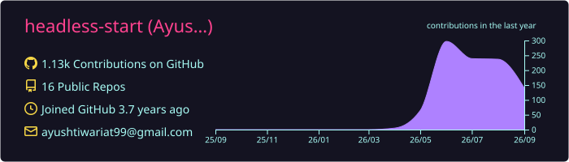

<h1>Hi there   </h1>
  <h1>I'm <b>Ayush Tiwari!</b> </h1>

 

## 👨‍💻 About Me

Hey! 👋 I'm an **AI/ML Engineer** working across **LLMs & RAG** 🧠, **Agentic AI** 🤖, **Computer Vision** 🖼️, and **Data Science** 📊 — I enjoy turning research ideas into clean, usable applications.

Let's connect and build something impactful together! ✨  

---

## 🌐 Socials

Find me on:

---

## 🛠️ Tech Stack

The technologies and tools my repositories are actually built with:

### Programming Languages
   

### Data Analysis & Visualization
   

### Machine Learning & Deep Learning
      

### Computer Vision & Transformers
  -654FF0?style=for-the-badge)  

### LLMs & RAG
     

### Agentic AI
       

### Tools & Environment
      

---

## 💬 A Guiding Thought

> *"We can only see a short distance ahead, but we can see plenty there that needs to be done."*
>
> — **Alan Turing**, *Computing Machinery and Intelligence* (1950)

---

## 📈 GitHub Stats

Here's a snapshot of my GitHub activity:

---

## 💻 Most Used Languages

 

---

## 📊 Contribution Graph

---

## 🏆 Profile Summary

---

## 🐍 Watch the Snake Eat My Contributions

<picture>
  <source media="(prefers-color-scheme: dark)" srcset="assets/snake-dark.svg">
  <source media="(prefers-color-scheme: light)" srcset="assets/snake-light.svg">
  
</picture>

---

⭐️ Thanks for visiting — have a great day! 😄

